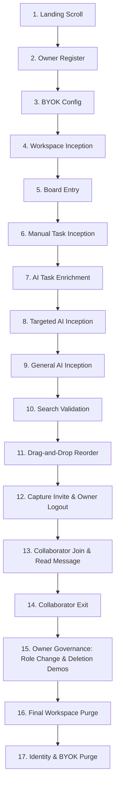

# 🛡️ FlowSync Sovereign E2E Recording Walkthrough

This document serves as the high-fidelity technical documentation for the **Sovereign E2E Demo Engine** built for FlowSync. It outlines the exact sequence, the browser APIs leveraged by Playwright, and the architectural rationale behind each transition gate.

---

## 🏗️ The E2E Architectural Matrix

The test suite in [recording.spec.ts](./recording.spec.ts) runs at a deliberate, human-like pace to guarantee high-definition recording clarity. It acts as an automated "Director's Cut," showcasing premium frontend aesthetics, real-time database reactivity, and robust backend endpoints.

---

## 📝 Detailed 17-Stage Demo Sequence

### 1. Landing Page Adaptive Scroll
* **Objective:** Showcase modern responsive styling, custom scrollbars, and premium typography.
* **Mechanism:** Smooth-scrolls viewport to the footer to expose structural landmarks, pauses for `5000ms`, and returns to top.

### 2. Owner Registration
* **Objective:** Establish the primary tenant identity.
* **Payload:** Generates unique `demo_${timestamp}_desktop@flowsync.test` credentials on each run — deterministic and non-colliding.

### 3. Settings & BYOK (Bring Your Own Key) Setup
* **Objective:** Anchor custom LLM parameters and API credentials before any AI interaction.
* **Steps:**
  1. Navigates to `/settings`.
  2. Demonstrates the **Technical Dark / Light theme switch**.
  3. Modifies the model configuration field to `gemini-2.5-flash`.
  4. Encrypts and anchors the API key, triggering toast-reconciliation.

### 4. Workspace Inception
* **Objective:** Create a named collaborative sanctuary board.
* **Action:** Orchestrates the creation of a workspace named `"Sovereign Architecture"`.

### 5. Board Entry & Column Creation
* **Objective:** Enter the workspace and scaffold the first infrastructure column.
* **Action:** Creates a column titled `"Strategic Objectives"` to provide a structured receptacle for tasks.

### 6. Manual Task Inception — Full Fields
* **Objective:** Prove that the manual inception modal captures and persists ALL fields end-to-end to the database.
* **Bug Fixed:** Previously `description` and `priority` were accepted by the UI but silently dropped by the backend validator. Now all fields are saved.
* **Fields Filled:**
  - **Title:** `"AES-256 Vault Architecture Design"`
  - **Description:** `"Sovereign encryption pipeline architecture, establishing private key generation logic and secure BYOK decryption gates."`
  - **Priority:** `High`
* **Confirms:** The Technical Details entered here will appear verbatim in the **Technical Breakdown** field when the card modal is opened.

### 7. Comment + AI Enrichment (Inside Task Modal)
* **Objective:** Demonstrate the collaborative note system and AI-powered task enrichment within a single card interaction.
* **Sequence:**
  1. Opens the newly created task card.
  2. Posts a technical note: *"Hi Collaborator, welcome to the sanctuary. Secure AES-256 vault plan initiated."*
  3. Clicks **Enrich with AI** — *Dynamically waits up to 60 seconds for the LLM inference to complete.*
  4. Saves changes via **Save Changes**.
  5. Modal auto-closes upon successful save.

### 8. Targeted AI Inception — Populate Column Cards
* **Objective:** Show prompt-driven vertical task generation within a specific column.
* **Mechanism:**
  * Uses Playwright's `page.once('dialog')` event handler to intercept and accept the browser prompt.
  * Input: `"Setup Kubernetes ingress controller"`.
  * *Dynamically waits for the 'Targeted Inception Complete' toast validation.*

### 9. General AI Inception — Create Column 2
* **Objective:** Demonstrate the top-bar goal orchestration system that creates a new column with tasks in one action.
* **Input:** `"Deploy a high-availability Redis cluster for session synchronization"`.
* **Result:** *Dynamically waits for the main Incept button to re-enable, confirming generation is complete.*

### 10. Search Validation — Dual-Path Querying
* **Objective:** Demonstrate sub-second search filters. Only tested now because multiple cards exist across multiple columns.
* **General Search:** Queries the global board header for `"AES-256"`.
* **Per-Column Search:** Queries the individual column search field for `"AES-256"`.
* **Clears:** Both searches are cleared after demonstration.

### 11. Drag-and-Drop Card Reorder
* **Objective:** Demonstrate desktop DnD interactivity and smooth task re-ordering.
* **Safety Gate:** DnD is only attempted if the source column has 2+ valid tasks — otherwise it is skipped to prevent white-screen crashes.
* **Action:** Grabs the first task card, performs a smooth `100px` vertical transition, and releases.

### 12. Deletion Feature Demos (Inside Workspace)
* **Objective:** Systematically demonstrate all destruction features before leaving the workspace.
* **Sequence:**
  1. **Purge Comment Feed:** Opens a task card → clicks `"Purge Feed"` → accepts dialog → confirms the comment thread is cleared.
  2. **Purge Task via Modal:** Clicks `"Purge Task"` inside the same modal → accepts dialog → task is removed from the board.
  3. **Quick-Delete via Card:** Hovers over a card → clicks the `Trash` icon (visible on hover, outside modal) → accepts dialog.
  4. **Delete Column:** Clicks the `Trash` icon in a column header (the `"Purge Column"` button) → accepts dialog → column and all its tasks are cascade-deleted.
* **Why Here:** All deletion features are workspace-level actions and must be showcased BEFORE the collaborator and workspace governance flows.

### 13. Invite Capture + Owner Logout
* **Objective:** Generate and capture the collaboration invite code.
* **Actions:**
  1. Clicks **Invite**, captures the unique 8-character invite code from the modal.
  2. Copies the code to clipboard.
  3. Closes the modal.
  4. Owner logs out cleanly.

### 14. Collaborator Join, Read & Exit
* **Objective:** Validate strict RBAC isolation, real-time board access, and unread notification delivery.
* **Actions:**
  1. Registers a new collaborator account (`collab_${timestamp}@flowsync.test`).
  2. Joins `"Sovereign Architecture"` using the captured 8-character invite code.
  3. Enters the board and auto-scrolls for visual inspection.
  4. Opens the task card — sees the owner's note as **unread** (red beacon active).
  5. Waits `5000ms` to simulate reading.
  6. Closes the modal and logs out.

### 15. Owner Returns — Governance & Workspace Purge
* **Objective:** Demonstrate administrator-level permission control and workspace cleanup.
* **Actions:**
  1. Owner logs back in.
  2. Enters workspace settings.
  3. Elevates the collaborator's role to **Contributor** (`member`).
  4. Purges/removes the collaborator from the workspace (dialog intercepted and accepted).
  5. Enters the workspace deletion password and clicks **Purge Workspace** — cascade-deletes all columns, tasks, and comments.

### 16. Guides Exploration
* **Objective:** Showcase the educational module depth of the platform.
* **Actions:**
  1. Navigates to `/guide/orchestrate` and auto-scrolls.
  2. Navigates to `/guide/collaborate` and auto-scrolls.

### 17. Settings — API Key Purge + Sovereign Account Purge
* **Objective:** Verify the double-authentication gate and demonstrate absolute, irreversible data erasure.
* **Actions:**
  1. Navigates to `/settings`.
  2. Clicks **Purge** to remove the Gemini API key.
  3. Clicks **Initiate Sovereign Purge** → enters password → confirms with **Confirm Purge**.
  4. Account, all data, and all tokens are physically removed from the database.
  5. User is redirected to the landing page — zero residual footprint.

---

> [!IMPORTANT]
> **API Key Safety:** The E2E script retrieves the `GEMINI_API_KEY` dynamically from the local backend env file without ever exposing it in plain text to the public repository or logs.

> [!NOTE]
> **Schema Fix Applied:** The `createTaskSchema` validation middleware was updated to include the `priority` field. Previously, priority set in the inception modal was silently stripped by Zod before reaching the service layer.

> [!TIP]
> **Recording Demos:** To record this protocol for presentation, run Playwright with the `--headed` flag and capture with Cursorful or OBS. The deliberate pauses (`waitForTimeout`) ensure the viewer has ample time to read dynamic prompts and observe real-time UI transitions.
